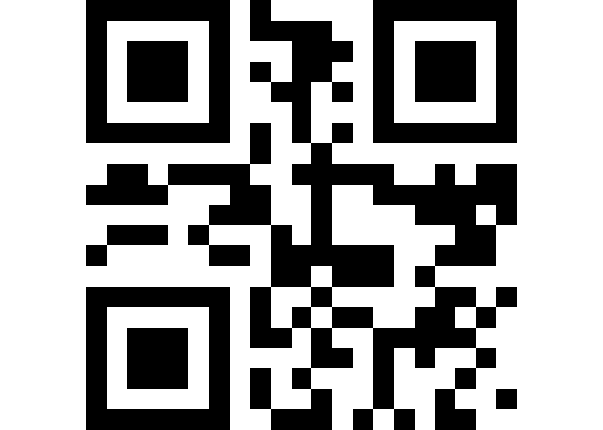

<!-- README.md is generated from README.Rmd. Please edit that file -->


`qrencoder` : Make QR codes in R

There is another package on CRAN -- `qrcode` -- that is not C-backed.

Quick Response codes (QR codes) are a type of matrix bar code and can be used to authenticate transactions, provide access to multi-factor authentication services and enable general data transfer in an image. QR codes use four standardized encoding modes (numeric, alphanumeric, byte/binary, and kanji) to efficiently store data. Matrix barcode generation is performed efficiently in C via the included 'libqrencoder' library created by Kentaro Fukuchi.

The following functions are implemented:

-   `qrencode`: Return a QR encoded string as a matrix
-   `qrencode_df`: Return a QR encoded string as an x, y, z data.frame
-   `qrencode_png`: Return a QR encoded string as a base 64 encoded inline png
-   `qrencode_raster`: Return a QR encoded string as a raster object

### Installation

``` r
devtools::install_github("hrbrmstr/qrencoder")
```

### Usage

``` r
library(qrencoder)
#> Loading required package: raster
#> Loading required package: sp

# current verison
packageVersion("qrencoder")
#> [1] '0.1.0'

url <- "http://rud.is/b"
head(qrencode(url))
#>      [,1] [,2] [,3] [,4] [,5] [,6] [,7] [,8] [,9] [,10] [,11] [,12] [,13] [,14] [,15] [,16] [,17] [,18] [,19] [,20]
#> [1,]    1    1    1    1    1    1    1    0    1     0     0     0     0     0     1     1     1     1     1     1
#> [2,]    1    0    0    0    0    0    1    0    1     1     1     1     0     0     1     0     0     0     0     0
#> [3,]    1    0    1    1    1    0    1    0    0     0     1     1     1     0     1     0     1     1     1     0
#> [4,]    1    0    1    1    1    0    1    0    1     0     1     1     0     0     1     0     1     1     1     0
#> [5,]    1    0    1    1    1    0    1    0    0     1     1     0     1     0     1     0     1     1     1     0
#> [6,]    1    0    0    0    0    0    1    0    0     0     1     0     0     0     1     0     0     0     0     0
#>      [,21]
#> [1,]     1
#> [2,]     1
#> [3,]     1
#> [4,]     1
#> [5,]     1
#> [6,]     1

head(qrencode_df(url))
#>   x  y z
#> 1 0 20 1
#> 2 1 20 1
#> 3 2 20 1
#> 4 3 20 1
#> 5 4 20 1
#> 6 5 20 1

qrencode_png(url)
#> [1] "data:image/png;base64,iVBORw0KGgoAAAANSUhEUgAAABUAAAAVCAAAAACMfPpKAAAACXBIWXMAAC4jAAAuIwF4pT92AAAAfElEQVQYlU2QWwrEMAwDR0vuf+XZj8qJSyjIyNYjAkAMQNFhkBCKzoNiin70kxKBN41ENuf7+9AZWQOGRx/2m4TeKy2YO0GyDpwszW5EUCs/ur78NZtGvSa8azdPDGttsonot8LtDFNnrs4yLSbuJk0ajnV3vevhCxUj4Q+R11n764g4WgAAAABJRU5ErkJggg=="

qrencode_raster(url)
#> class       : RasterLayer 
#> dimensions  : 21, 21, 441  (nrow, ncol, ncell)
#> resolution  : 0.04761905, 0.04761905  (x, y)
#> extent      : 0, 1, 0, 1  (xmin, xmax, ymin, ymax)
#> coord. ref. : NA 
#> data source : in memory
#> names       : layer 
#> values      : 0, 1  (min, max)

par(mar=c(0,0,0,0))
image(qrencode_raster("http://rud.is/b"), 
      asp=1, col=c("white", "black"), axes=FALSE, 
      xlab="", ylab="")
```



### Test Results

``` r
library(qrencoder)
library(testthat)

date()
#> [1] "Thu Sep 15 18:01:43 2016"

test_dir("tests/")
#> testthat results ========================================================================================================
#> OK: 0 SKIPPED: 0 FAILED: 0
#> 
#> DONE ===================================================================================================================
```

### Code of Conduct

Please note that this project is released with a [Contributor Code of Conduct](CONDUCT.md). By participating in this project you agree to abide by its terms.
